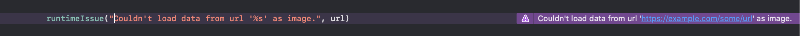
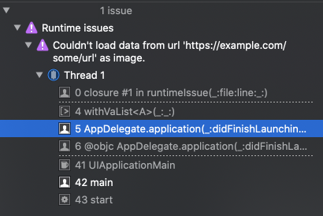
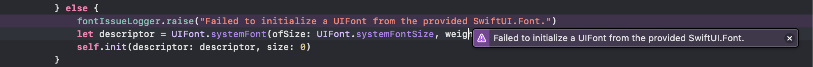
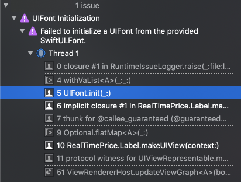

# Runtime Issues

Trigger runtime issues from your code during development or debugging. These are helpful diagnostics used by Xcode which highlight the offending line and also provide detailed information in the "Runtime" section of Xcode's Issue Navigator.

## Usage

Log a generic runtime issue:

```swift
import RuntimeIssues

runtimeIssue("Couldn't load data from url '%s' as image.", url)
```





Create your own logger for logging categorized failures:

```swift
import RuntimeIssues
import SwiftUI

fileprivate let fontIssueLogger = RuntimeIssueLogger(category: "UIFont Initialization")

extension UIFont {

  convenience init?(_ font: Font) {
      if someCondition {
          // A lot of shameful malarkey to parse out the structure of a SwiftUI.Font...
      } else {
          fontIssueLogger.raise("Failed to initialize a UIFont from the provided SwiftUI.Font.")
          let descriptor = UIFont.systemFont(ofSize: UIFont.systemFontSize, weight: .regular).fontDescriptor
          self.init(descriptor: descriptor, size: 0)
      }
  }
```






## Behind the scenes

The idea for this library came from SwiftUI's own runtime issue logging; for example, if an `Image` from an app bundle or an SF Symbol is initialized with an invalid name, the failure is logged as a runtime issue exactly once by SwiftUI. What exactly are the benefits of this different kind of failure reporting?

* Runtime issues strike the balance between convenience and salience: they are not fatal errors so the running process isn't entirely halted—which can be a significant interrupt for a developer—and they show up in multiple places in Xcode which helps to remove the burden of finding the source of unexpected behavior.
* This kind of issue reporting is (currently) fairly limited in use. The various sanitization tools aren't enabled by default and, outside of the main thread checker or constraint debugger, aren't something most Swift developers will ever need to worry about using. Since the heads-up alerts for runtime issues are not ubiquitous, they tend to being more recognizable than logging alone.

### Caveats

The implementation is full of black-magic wizardry and is intended to be used for debugging alone. This is not a replacement for logging and may break at any given time. You should use this in addition the first-party logging APIs provided by Apple.

Logging was recently updated to provide for a modern, Swift-friendly interface. You can check out the WWDC presentation [here](https://developer.apple.com/videos/play/wwdc2020/10168/).

### Swift Evolution

Expanding diagnostic directives has been a [point of discussion](https://forums.swift.org/t/se-0196-compiler-diagnostic-directives/8734) and the focus of [an implemented Swift evolution proposal](https://github.com/apple/swift-evolution/blob/main/proposals/0196-diagnostic-directives.md). Runtime issues [were elicited](https://forums.swift.org/t/se-0196-compiler-diagnostic-directives/8734/7) as a useful diagnostic tool, but as of yet remain to have a faithfully-public interface.

## Requirements

### SDK

Tested with the following, but might work with earlier:

* Xcode 12
* Swift 5.3

### Deployment targets

* iOS 12.0+
* tvOS 12.0+
* watchOS 5.0+
* macOS 14.0+

## Installation

### Swift Package Manager

From Xcode, you can find the interface for 

Add the following dependency to your `Package.swift` file:

```swift
.package(url: "https://github.com/rpwachowski/runtime-issues", from: "1.0.0")
```

Then, include it as a dependency of your target:

```swift
// swift-tools-version:5.3

import PackageDescription

let package = Package(
    name: "Example",
    dependencies: [
        .package(url: "https://github.com/rpwachowski/runtime-issues", from: "1.0.0")
    ],
    targets: [
        .target(name: "Example", dependencies: ["RuntimeIssues"])
    ]
)
```

### Carthage

###### Not yet implemented

### Cocoapods

###### Not yet implemented

## Contributions

If you run into any problems using this library or spot a way to make it better, don't hesitate to open an issue. I hacked this together rather quickly so I'm sure there are a ton of ways it can be improved.
